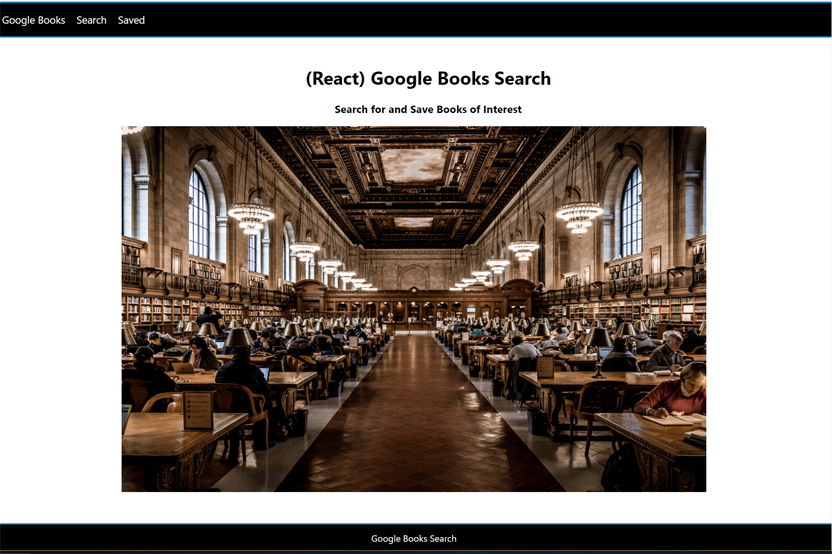

# Google-Books-Search
MERN stack SPA that allows user to search/save books

Run Application: [Launch Google-Books-Search ](https://thawing-lowlands-88251.herokuapp.com/)

**Features**
* Search google for book titles
* Save book information to database
* View extended book information
* Delete book information from database

**Technologies Used**
* JavaScript
* Node.js
* Express.js
* Mongoose
* React.js
* Axios
* Model View Controller (MVC) design pattern
* RESTful API design
* Heroku (deployment)

**Problems to Solve**
* Dynamically search for books
* Create reusable UI components for more flexible, maintainable UI
* Allow user to interact with content (view/save/remove)
* Securely and reliably store data, with scalability in mind
* Design for separation of concerns to improve maintainability/expandability of code
* Deploy full-stack project for others to use

**Solutions**
* Implement free version of Google Books API
* Build and render components using React, JSX
* Use Mongoose for noSQL database manipulation
* Combine Mongoose, Express and React Router for routing and CRUD operations
* Follow Model View Controller (MVC) design pattern
* Deploy project using Heroku

**Setup to run application on your system**
* Node.js must be installed on your system
* Clone the Google-Books-Search repo into a dirctory on your system
* From command line, while in that directory key:
```
 npm install
```
* Then, key:
 ```
 npm start
  ```
* In browser, navigate to "http://localhost:3000", you should see the Google-Books-Search application



**To use Google-Books-Search**
* Select the Search menu option to search for books
  * user may click VIEW button to view additional book information
  * user may click SAVE button to save that book to database
* Select the Saved menu option to see user's list of saved books
  * user may click Book Info link to view additional book information
  * user may click the red X to delete the book from user's database

**Resource Contributors**
* Home page image: [Unsplash: Library](https://unsplash.com/photos/OvXht_wi5Ew)
* Book information retrieved using: [Google Books API](https://developers.google.com/books/docs/overview)

**Future Enhancement Ideas**
* Improve error checking
* Add Options for Book Notes
* Add Status messages (Book Saved, Book Removed, etc.)
* Add Test cases

